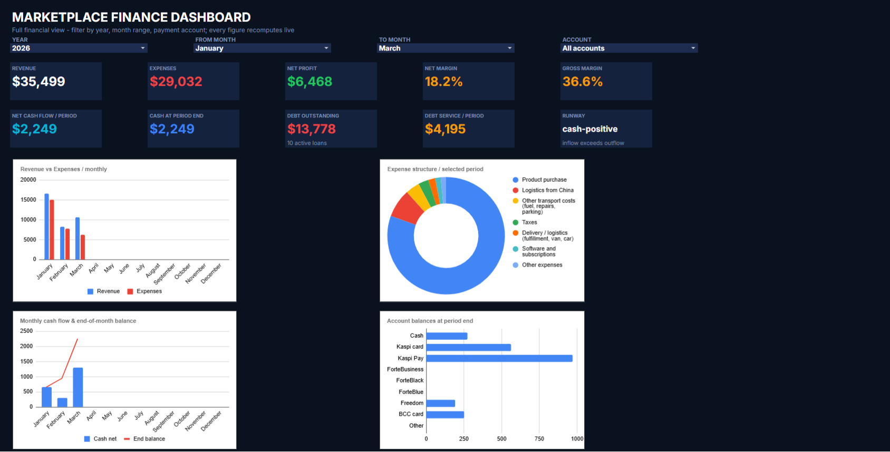
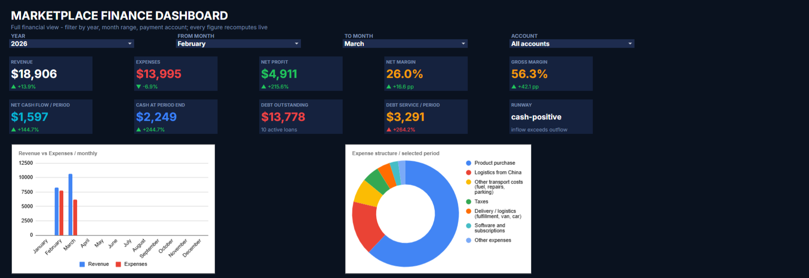
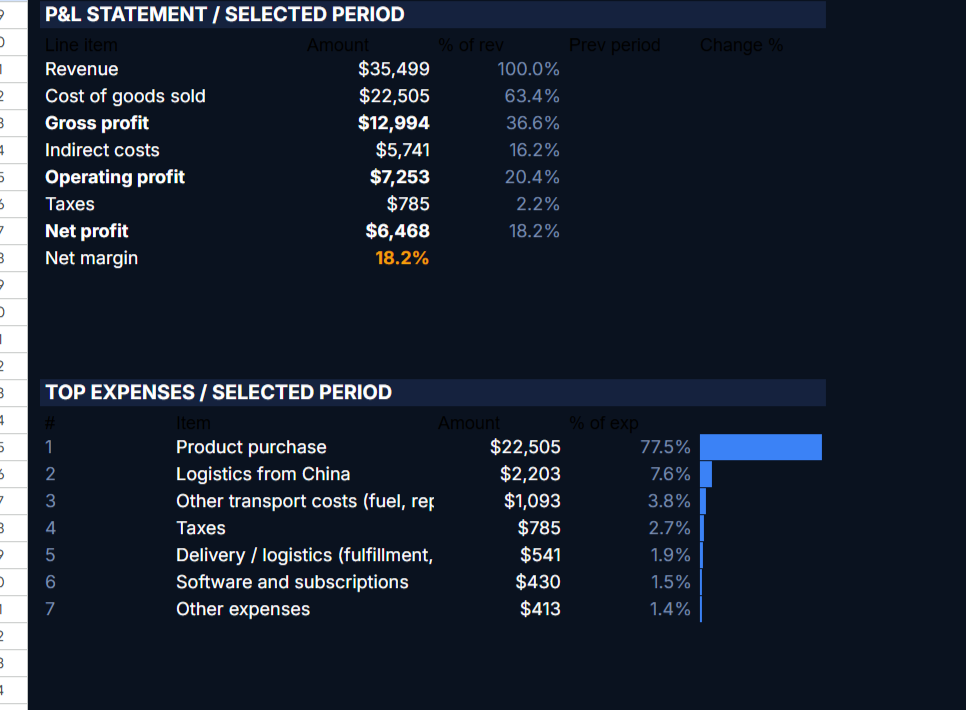
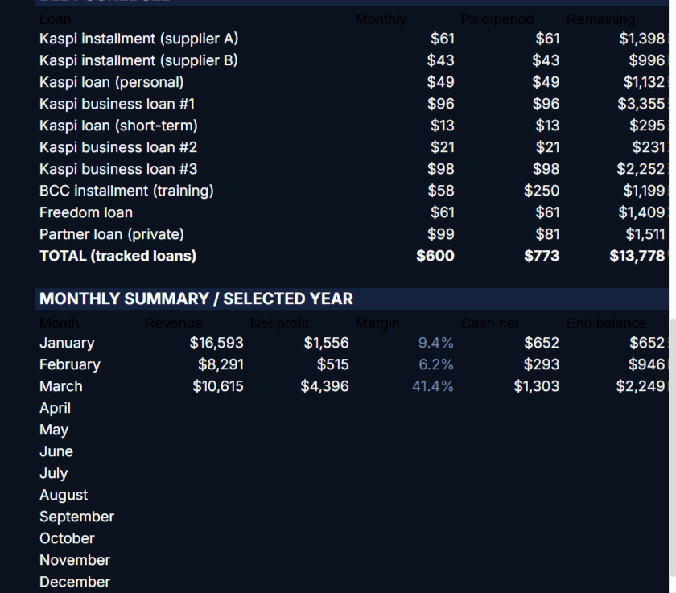
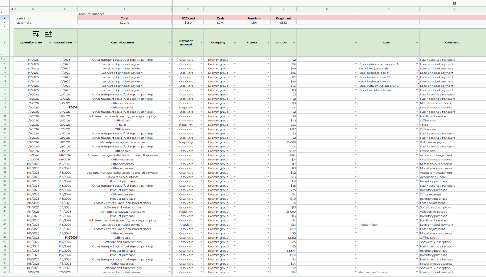

# Marketplace Finance Tracker + Interactive BI Dashboard (Google Sheets)

A finance tracker rebuilt in Google Sheets into a clean, USD, English workbook
with a **BI-style dashboard**: filters for year, month range and payment account
drive **10 KPI cards with prior-period deltas**, a full **P&L statement**, a
**10-loan debt schedule**, a top-expenses breakdown, a monthly summary and
**four live charts** — all recomputed live from raw transactions.

🔗 **Live demo (view-only, File → Make a copy):**
https://docs.google.com/spreadsheets/d/1Bf283tQEyUtzlq3Yar_Vx8mDNhB5NKjpA4tkEfwpbEg

## Who it's for
Owners of a small business or online store whose spreadsheet has stopped keeping
up: hundreds of operations a quarter across several accounts, mixed currencies,
an empty P&L, and formulas that silently miss rows.

## The problem it solved
The original tracker had **800+ operations a quarter**, an **empty P&L** (accrual
dates were never filled), and engine formulas that **silently counted only the
first ~100 rows** — so profit for two months out of three showed as zero. It was
rebuilt into a clean USD workbook and the core formulas were **repaired to cover
the whole ledger**.

## What's inside
- **10 KPI cards** with prior-period deltas (revenue, COGS, gross %, net %, cash, debt…).
- **P&L statement** with % of revenue and a prior-period column.
- **Debt schedule** — 10 loans, monthly payments, remaining balances.
- **Top expenses**, **12-month summary**, **runway**.
- **4 live charts** — revenue vs expenses, expense structure, cash flow with
  running balance, account balances.
- **Filters** — year, month range, payment account; everything recalculates in
  three clicks.

## Screenshots
| KPI + prior-period deltas | P&L statement |
|---|---|
|  |  |
| Debt schedule | Transactions ledger |
|  |  |

## Notes
All figures are synthetic / anonymized demo data. The workbook runs on live
Google Sheets formulas (array-formula spill helpers, QUERY, EDATE) — open the
live demo link above to see it working.

## Tech
Google Sheets · live formulas (SUMPRODUCT, QUERY, EDATE) · array-formula spill
helpers · native charts · financial modeling & formula repair.

## License
MIT — see [LICENSE](LICENSE).
